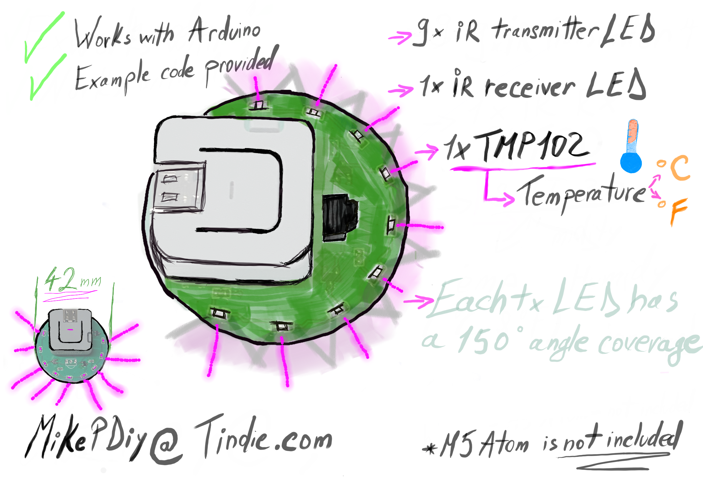

<b>What is this board?</b>

This is what I consider the best thing you can have to use in a HomeAutomation setup as it is small, works with the M5Atom out of the box and it has IR RX and TX plus a very precise Temperature sensor. 

<b>How did this board came to life ?</b>

I have recently got into the Apple HomeKit system and I was not that happy with the costs and range of accesorries so I have gotten down the route of HomeBridge and used the amazing system that the people behind this project gave to the community . 
Now I needed to reduce the space used by all my messy wires and integrate as many sensors as I could in one small package that can sit in a room.

<b>What does this board offer in terms of sensors : </b>

1. 9 x IR Transmitter LED with 150degree angle of transmission each 
2. 1 x IR Receiver to help in grabbing signals or repeating them
3. 1 x TMP102 Temperature Sensor to help in automation setups lilke " IF the Office Temp goes over 28 Celsius then turn AC ON but if it goes under 25 turn AC OFF." Due to the small size of the board the temperature reading is influenced by the proximity to the M5Atom and you have to calibrate that once you get the board. I have tried many ways to counter this problem but at the end of the day it would be hilarious in shape and too big so it would defeat the purpose of being a useful small piece of kit.

<b>Why to buy this board ? </b>

Well, that would help me and allow me to keep developing boards like this while improving the board I have already made . 
This board in conjuction with some Arduino knowledge will allow you to tailor the way it works to perfectly fit your Home Automation setup.
The software and the pinout of the board is open sourced and you can see all the details you need here in order to play with the software yourself. 
Of course I can not be held responsible if you damage the board while doing this.

<b> Needed software and libraries to work with this board : </b>

IDE : Arduino 1.8.3 ( I assume it will work with others like PlatformIO but I have not tested it so I warrant for Arduino IDE on Windows 10 , MacOS Catalina and linux flavours based on Ubuntu 20.04)

Board BSP : ESP32

Libraries : 

-M5Atom

-IRremoteESP8266

-SparkFunTMP102

<b>Pinout :</b>

IR RX - 21

IR TX - 25

SDA - 23

SCL - 33

Alert - 19

To set the I2C pipe please put in void setup() the following Wire.begin(23,33) 

<b> With the Demo Code from each library, IRremoteESP8266 example IRrecvDumpV2 and SparkFunTMP102 Example1_Basic_Temperature_Readings , it reads the temperature in Celsius and/or Fahrenheit and will print it in SerialMonitor or a SignalDump using the IRremoteESP8266 example IRrecvDumpV2 . You can take this further and build on it including the IR TX functionality and and also integrate with an MQTT client to work with HomeBridge. </b>

<b> Where to buy the board </b>

Tindie Link Here
